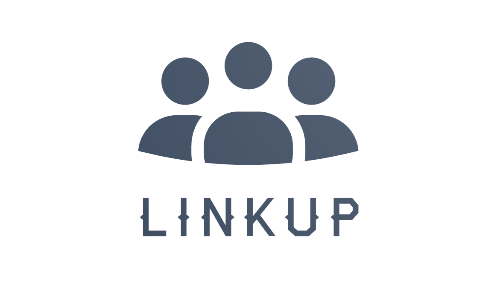

# LinkUp Project - DevFest 2021



Chào mừng mọi người đến với dự án LinkUp, đây là một dự án cộng đồng nhằm hướng đến giúp đỡ cho những người có hoàn cảnh khó khăn đang cần giúp đỡ do ảnh hưởng của dịch bệnh COVID-19.

## Lời cảm ơn

Đầu tiên, team xin chân thành cảm ơn anh **Mai Đức Duy** đã tận hình hỗ trợ tụi em trong 3 ngày lên ý tưởng và thực hiện dự án vừa qua.

Ngoài ra, cảm ơn ban tổ chức **DevFest 2021** đã đã hỗ trợ tụi em kiến thức Flutter thông qua 5 ngày training và cho tụi em cơ hội làm cùng anh Duy trong 3 ngày trong dự án này.

## Tổng quan

Ứng dụng được phát triển bằng Flutter trong 3 ngày tham dự cuộc thi DevFest và Sử dụng ExpressJS làm Backend. Mục đích dự án tạo ra một ứng dụng để cho mọi người có thể hỗ trợ lẫn nhau trong tình hình dịch bệnh hiện tại và tụi mình có mở **Public APIs** với mục đích mong muốn các cộng đồng các có thể tích hợp vào để lan toả cộng đồng giúp đỡ lẫn nhau vượt qua đại dịch này.

Hiện nay, do ảnh hưởng của đại dịch COVID-19 người dân Việt ngày càng gặp nhiều khó khăn do dịch bệnh kéo dài. Vì vậy, LinkUp ra đời nhằm giúp đỡ cho những người gặp khó khăn, tiếp nối truyền thống "Lá lành đùm lá rách" của nhân dân ta. Ứng dụng phát triển theo tiêu chí dễ dàng để sử dụng. Các bạn chỉ cần download ứng dụng về là có thể xem những người đang gặp khó khăn ở xung quanh mình.

## Hướng dẫn sử dụng

**Tải ứng dụng:**

Tải ứng dụng hoặc tự cài đặt trên máy thông qua đường link dưới đây:

```
https://github.com/lygioian/devfest2021/
Có thể cài đặt flutter và vào folder frontend/mdc_100_series gọi flutter run để start app
```

### Đối với người cần hỗ trợ

**Bước 1:**

Mở ứng dụng ở trang chủ và chọn mình cần giúp đỡ

**Bước 2:**

Chấp nhận tính năng yêu cầu vị trí người dùng. Chọn những vật dụng mình đang cần và tạo bài đăng.

### Đối với người cần hỗ trợ

**Bước 1:**

Mở ứng dụng ở trang chủ và chọn trang giúp đỡ, sau đó google map sẽ hiện ra

**Bước 2:**

Nhấn chọn những người gần để xem họ cần giúp đỡ những vật dụng nào, nếu có thể hỗ trợ thì có thể liên hệ thông qua thông tin trong ứng dụng

## Public APIs

Các bạn có thể truy cập public apis thông qua https://api.devfest.top/post. Tất cả APIs không yêu cầu bất kỳ xác thực nào để có thể sử dụng, mục đích hướng đến việc mở rộng xây dựng một cộng đồng chia sẻ giúp đỡ nhau qua mùa dịch. Dự án thiết kế với 4 APIs đơn giản để có thể dễ dàng tích hợp vào ứng dụng của bạn như một tính năng

Các public APIs hỗ trợ cho các cộng đồng các có thể lấy về để lan rộng cộng đồng hỗ trợ hơn ở những ứng dụng cộng đồng khác.

```js
HTTP REQUEST - POST: "https://api.devfest.top/post" -> Tạo bài đăng cần hỗ trợ.
/*
POST Request Structure
{
    "title": "Tôi rất cần giúp đỡ",
    "name": "Nguyễn Văn Bình",
    "tel": "093749593",
    "description": "Nhà tôi đang gặp khó khăn, chồng tôi không đi làm được 3 tháng nay rồi",
    "requestHelp": "Nhà tôi có 2 đứa con nhỏ, hi vọng có ai đó giúp tôi một ít sữa cho con",
    "coordinates": ["41.40338", "2.17403"],
    "address": "591 Đ. Nguyễn Văn Trỗi"
}
Response
{
    "success": true,
    "code": 200,
    "message": "Create Post Success",
    "payload": {
        "post_key": "61af9429a3578e6e7ba4cb1c"
    }
}
*/
```

Khi tạo bài đăng hỗ trợ thì sẽ được server trả về một post_key. post_key này dùng để xác thực các bạn khi muốn xoá hoặc thay đổi thông tin bài đăng

```js
HTTP REQUEST - GET: "https://api.devfest.top/post" -> Trả về danh sách các bài đăng hỗ trợ
/*
POST Request Structure
Response
{
    "success": true,
    "code": 200,
    "message": "Create Post Success",
    "payload": <List of Posts>
}
*/
```

```js
HTTP REQUEST - GET BY ID: "https://api.devfest.top/post/:post_id" -> Trả về danh sách các bài đăng hỗ trợ
/*
POST Request Structure
Response
{
    "success": true,
    "code": 200,
    "message": "Create Post Success",
    "payload": <List of Posts>
}
*/
```

Ngoài ra, tụi mình hỗ trợ cho mọi người PATCH và DELETE bài đăng với post_key. Đừng lo nếu bị lost post_key nhé! Vì sau 7 ngày bài đăng sẽ tự động bị xoá khỏi dữ liệu.

```js
HTTP REQUEST - PATCH: "https://api.devfest.top/:post_key"
HTTP REQUEST - DELETE: "https://api.devfest.top/:post_key"
```

## Thành Viên

Đội ngũ phát triển gồm 4 thành viên và 1 mentor.
Team xin chân thành cảm ơn anh **Mai Đức Duy** đã tận hình hỗ trợ tụi em trong 3 ngày thực hiện vừa qua.

Ngoài ra, cảm ơn ban tổ chức **DevFest 2021** đã tạo cơ hội cho nhóm chúng em được tiếp cận với Flutter qua những bài Codelab. Cũng như đã hỗ trợ cho tụi em hoàn thành dự án này

Thành viên tham gia:

1. Lý Giới An
2. Nguyễn Trần Khôi
3. Lý Thiên Ân
4. Trần Hữu Phúc An
